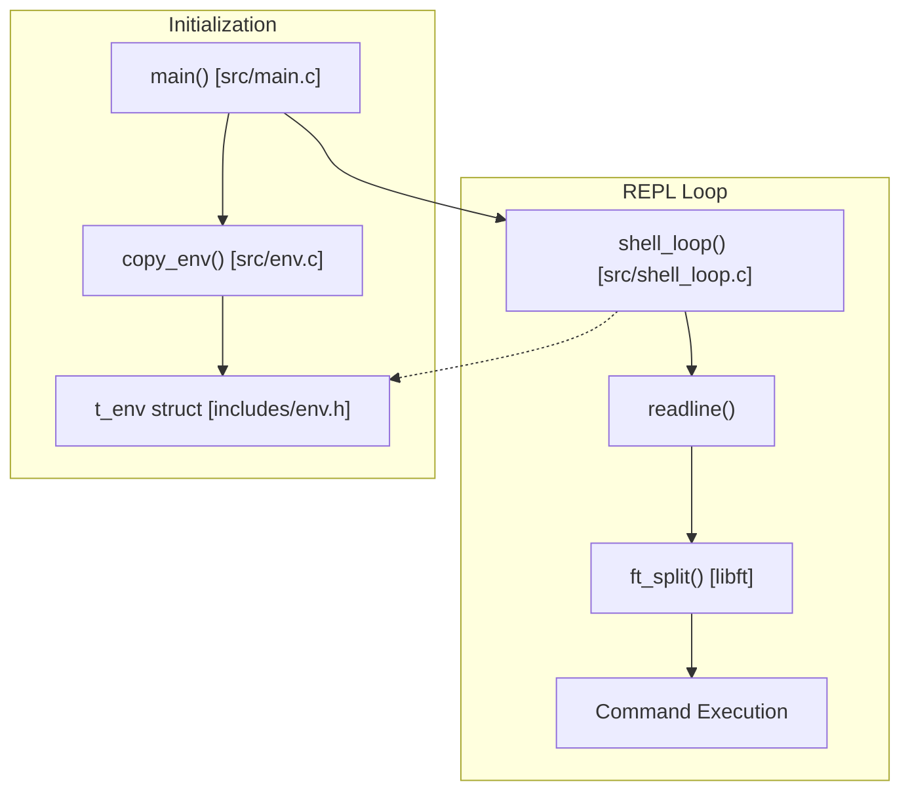
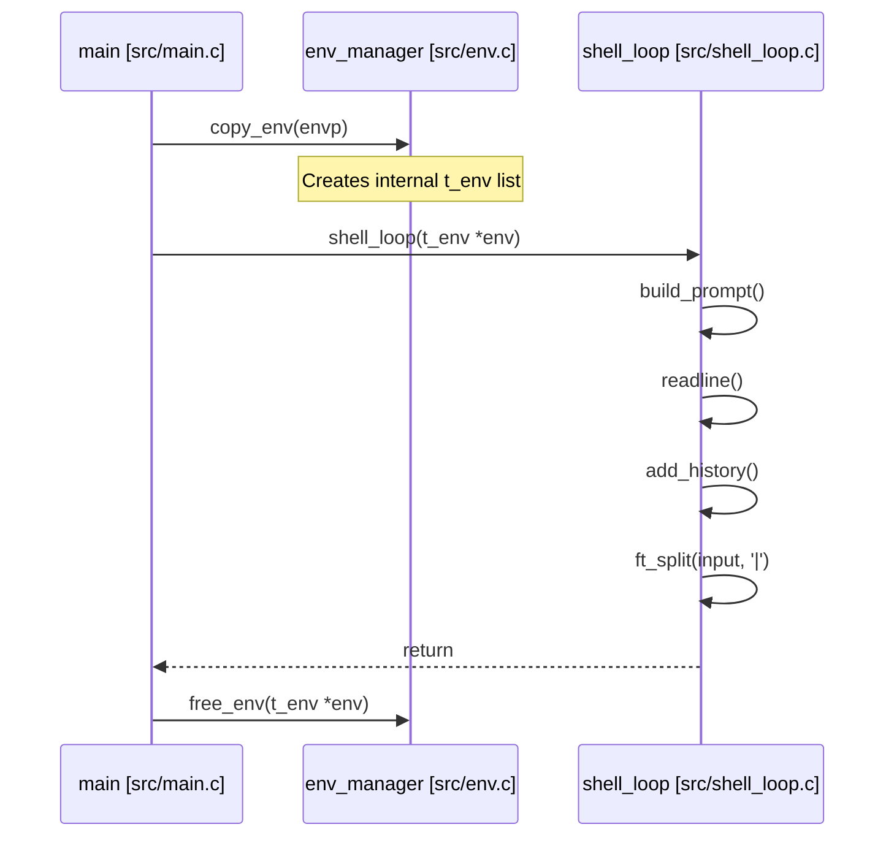

# Minishell Overview
Relevant source files
- [Makefile](https://github.com/Igbescobar/minishell/blob/aaffaa2b/Makefile)
- [README.md](https://github.com/Igbescobar/minishell/blob/aaffaa2b/README.md?plain=1)

Minishell is a custom implementation of a basic command-line shell, modeled after `bash`[README.md1-3](https://github.com/Igbescobar/minishell/blob/aaffaa2b/README.md?plain=1#L1-L3) It provides a persistent interactive interface designed to parse user input, manage environment variables, and execute commands within a Read-Eval-Print Loop (REPL).

The project serves as a practical exploration of systems programming in C, focusing on process management, environment handling, and string manipulation using a custom utility library.

## Key Features

The shell implements several core functionalities required for a modern terminal interface:

- **Interactive Prompt**: A dynamic prompt that reflects the current context in the format `user@hostname:path$`[README.md7](https://github.com/Igbescobar/minishell/blob/aaffaa2b/README.md?plain=1#L7-L7)
- **Command History**: Integration with the `readline` library to allow users to navigate previous commands using arrow keys [README.md8](https://github.com/Igbescobar/minishell/blob/aaffaa2b/README.md?plain=1#L8-L8)
- **Environment Management**: The shell creates an internal managed copy of the system's environment variables (`char **envp`) upon startup [README.md9](https://github.com/Igbescobar/minishell/blob/aaffaa2b/README.md?plain=1#L9-L9)
- **Input Tokenization**: Initial support for parsing and splitting commands, specifically handling the pipe (`|`) character [README.md10](https://github.com/Igbescobar/minishell/blob/aaffaa2b/README.md?plain=1#L10-L10)

## System Components

The minishell architecture is divided into three primary logical areas: the entry/initialization sequence, the interactive shell loop, and the environment management system.

### Component Relationship Diagram

This diagram illustrates how the primary source files and data structures interact during the shell's lifecycle.

**Sources:**[src/main.c11-23](https://github.com/Igbescobar/minishell/blob/aaffaa2b/src/main.c#L11-L23)[src/shell_loop.c51-68](https://github.com/Igbescobar/minishell/blob/aaffaa2b/src/shell_loop.c#L51-L68)[src/env.c11-30](https://github.com/Igbescobar/minishell/blob/aaffaa2b/src/env.c#L11-L30)[includes/env.h11-16](https://github.com/Igbescobar/minishell/blob/aaffaa2b/includes/env.h#L11-L16)

## Project Organization

The codebase is structured to separate the core shell logic from utility functions and header definitions.

| Directory | Purpose | Key Entities |
| --- | --- | --- |
| `src/` | Core logic | `main.c`, `shell_loop.c`, `env.c` |
| `includes/` | Definitions | `minishell.h`, `env.h` |
| `libft/` | Utility Library | Custom `printf`, `get_next_line`, and standard C functions |
| `obj/` | Build Artifacts | Compiled `.o` files |

For a detailed breakdown of the file roles and the compilation process, see [Project Structure](/Igbescobar/minishell/1.2-project-structure).

**Sources:**[README.md50-64](https://github.com/Igbescobar/minishell/blob/aaffaa2b/README.md?plain=1#L50-L64)[Makefile9-13](https://github.com/Igbescobar/minishell/blob/aaffaa2b/Makefile#L9-L13)

## Execution Flow

The following diagram maps the high-level logic flow from the program entry point to the command processing phase.

**Sources:**[src/main.c11-23](https://github.com/Igbescobar/minishell/blob/aaffaa2b/src/main.c#L11-L23)[src/shell_loop.c51-68](https://github.com/Igbescobar/minishell/blob/aaffaa2b/src/shell_loop.c#L51-L68)[src/env.c54-66](https://github.com/Igbescobar/minishell/blob/aaffaa2b/src/env.c#L54-L66)

## Getting Started

To compile Minishell, you require `gcc`, `make`, and the `libreadline-dev` library [README.md14-17](https://github.com/Igbescobar/minishell/blob/aaffaa2b/README.md?plain=1#L14-L17) The build process is managed via a root `Makefile` that also triggers the compilation of the internal `libft` library [Makefile20-22](https://github.com/Igbescobar/minishell/blob/aaffaa2b/Makefile#L20-L22)

For a step-by-step guide on installation and basic usage, see [Getting Started](/Igbescobar/minishell/1.1-getting-started).

**Sources:**[README.md21-31](https://github.com/Igbescobar/minishell/blob/aaffaa2b/README.md?plain=1#L21-L31)[Makefile1-22](https://github.com/Igbescobar/minishell/blob/aaffaa2b/Makefile#L1-L22)